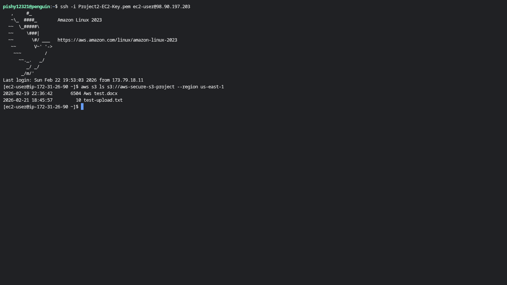
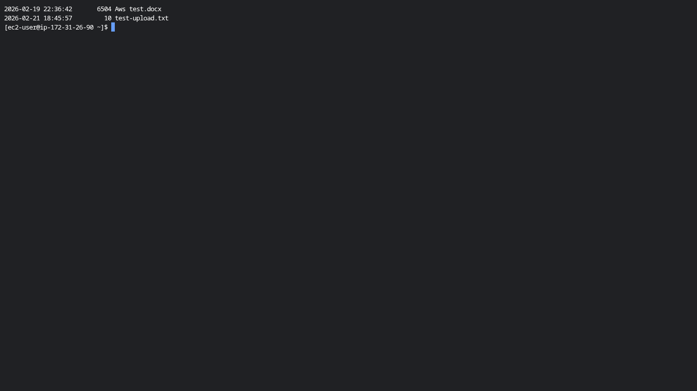
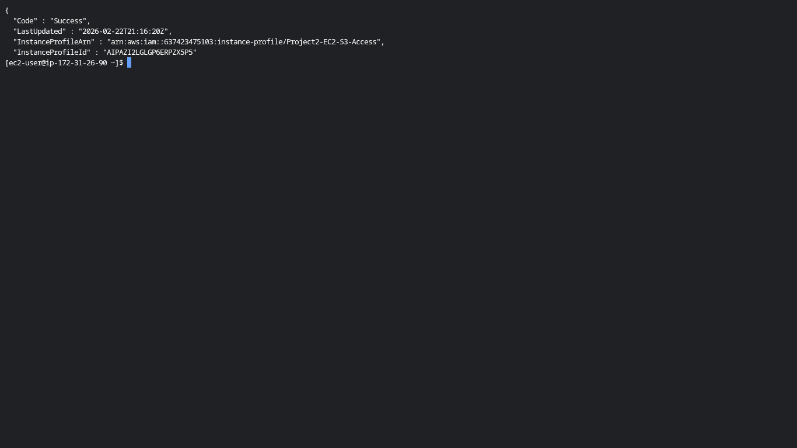

# AWS-EC2-S3-Project

Hands-on AWS project demonstrating an EC2 instance with an attached IAM role accessing a secure S3 bucket.  
The project includes screenshots showing EC2 login, IAM role verification, and S3 access, plus the S3 bucket policy file.

## Project Screenshots

### 1️⃣ EC2 Login

### 2️⃣ IAM Role Attached to EC2

### 3️⃣ S3 Access from EC2

## Project Files

- [S3SecureProjectPolicy.json](S3SecureProjectPolicy.json) – Bucket policy for EC2 access
